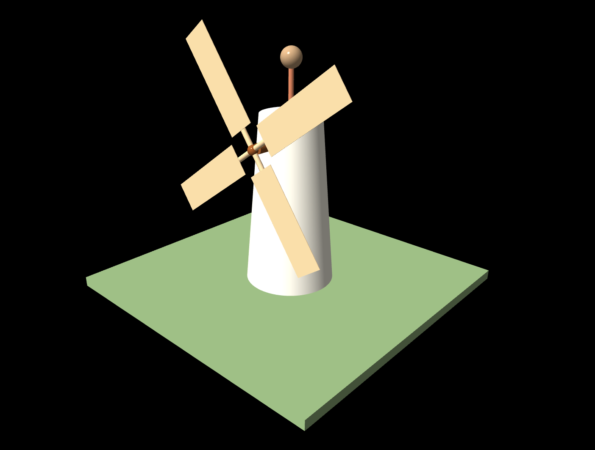

# RT_Rendering_Lab3
A Hierarchical (6 hierarchy) Windmill.

## Usage

1. `w`, `a`, `s`, `d` for moving the object `forward`, `left`, `backward`, `right`.

2. `⬆️`, `⬇️`, `⬅️`, `➡️` for moving the camera `forward`, `left`, `backward`, `right`.

3. `P/p`, `Y/y`, `R/r` for `increasing/decreasing` the pitch, yaw and roll angle. 

## Bonus point attempted
1. Matrix operation from scratch

2. Quaternion for camera rotation

## Software Info
Operating system: Windows 11

Web browser: Microsoft Edge